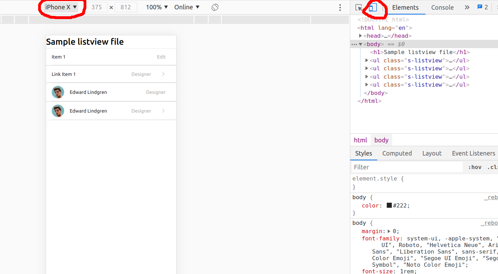

Design guide for mobile pages
=================================

Add viewport
--------------------
When designing a web page for mobile device don't forget to add the following viewport code to your html `<head>`:

```html
<meta name="viewport" content="width=device-width, initial-scale=1.0, maximum-scale=1.0, user-scalable=0">
```

File structure
--------------------
We use the same concepts of BEM and 3-layer css as explained in the general design guide. For mobile pages we the `bundle.m.css` (instead of `bundle.css`) which joins together the 3 design layers:

1. Layer 0: `_layouts.scss`: The same layouts file used for the desktop pages. Note that layouts represent generic layout/positioning classes which are used equally cross all devices. They are kind of *extensions* of the browser which allow us to place items nicely side by side (=d-flex class), align them in the center (=align-items-center), etc. These classes are the same for all devices.
   
2. Layer 1: `_styles.m.scss`: Note that these layer 1 styles are opinionated and thus are different from teh desktop version (_styles.scss). However, they share certain components (such as _btns.scss), but differ in other components (like _menus.m.scss vs _menus.scss). We try to reuse the components as much as possible for both desktop and mobile, but in cases of significant difference we will need to create a separated mobile version. Note that the mobile version ends with **.m.scss** to indicate that this file contains style dedicated to mobile design (like _menus.m.scss which is the mobile version of _menus.scss). 

3. Layer 2: `_project.scss`: For now we don't have to worry about layer 2 mobile components, as they are mostly going to be the same as the desktop version. Basically we hope that the layer 2 components are responsive enough to be used in both devices. However, in case that in the future we had to split designs then maybe we create a separate `_project.m.scss` file ...

Note that in the `bundle.m.scss` we also changed some of the layout variables (like $font-size-root which is from the bootstrap). This is to adjust more to the mobile page. If need be, we can change more variables and later we re-organize changes into a separate file.  


Using developer tools to view your mobile design
--------------------------------------------------
When designing mobile pages you can use the browser developer tools to get a *mobile view* of your design. You can choose different mobile devices (-> different screen sizes) and check how your design looks on them. Here is an screenshot:




MobileKit theme
---------------------
We use a them called Mobilekit as a reference model for our design. You can access a preview at [this link](https://mobilekit.bragherstudio.com/). In the preview, you may open the toggle menu to see a demo of different designs. The item "components" in this menu is of particular interest and we will refer to the component in that page quite often. For example, when I mention `Components > buttom menu` we mean you go to the main toggle menu, click on *components* link, then click on *button menu* link to open the page that is needed. 

We don't need to make our design 100% similar to this, but it is used to give us (=you) idea of what you are supposed to build. Nevertheless, since most of these components are based on standard design, probably we have to follow their design closely.

While designing, you may also take a look at this theme source code (using the browser developer tool) to get idea of what type of css styles they use. Sometimes you may find them using tricky styles (like `-webkit-...` styles) which would be good that we adopt them too.


